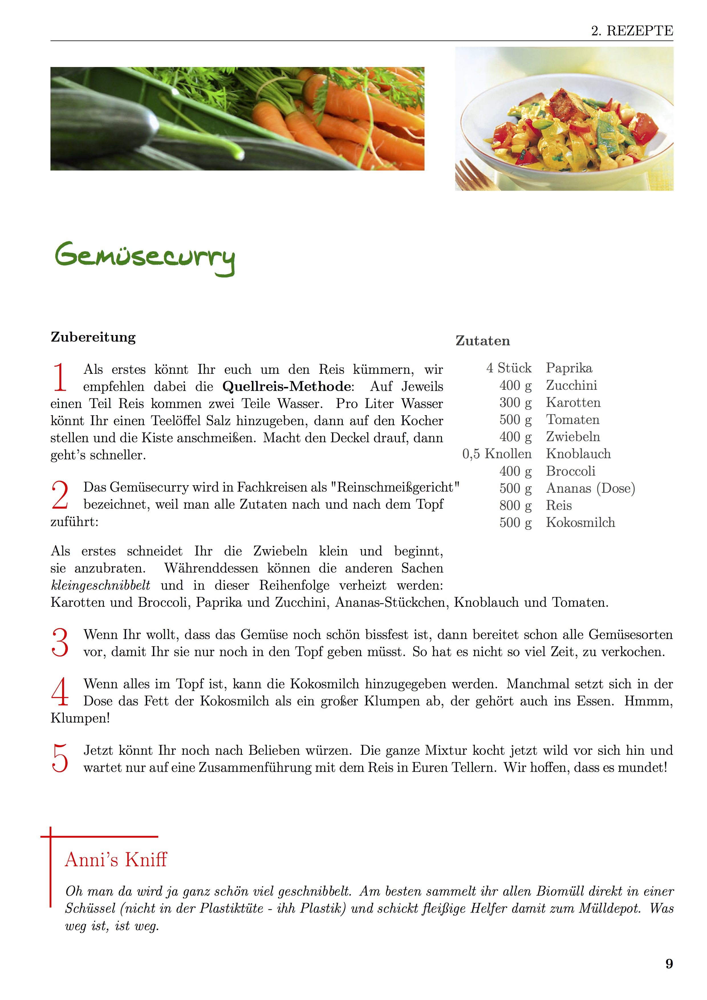

# Landeslager Kochbuch

Dieses Repository beinhaltet das Kochbuch des Landeslagers 2016 in Großzerlang. Es ist in LaTeX gesetzt und in einzelne Rezepte unterteilt. Es kann gut restruktiriert und erweitert werden.

## Mengenkalkulation

Die Rezepte sind stets auf 10 Personen angepasst. Da die Verpflegung auf dem Lager in Kisten stattgefunden hat, sind die entsprechenden Mengen sowieso schon abgewogen.

## Schwierigkeit 

Die Rezepte sind gut in großen Mengen kochbar und meistens auch für wenig erfahrene Köche umsetzbar. Gewürze sind stets nur im Rezept erwähnt und nur in Einzelfällen als extra Zutat erwähnt.

## Design

Das Kochbuch ist mithilfe des LaTeX Package [xcookybooky](https://www.ctan.org/pkg/xcookybooky) von Sven Harder umgesetzt. Es werden Titelbilder, Anleitung und Notizen genutzt. Kochzeiten, Zubehör ist nicht genutzt, da nur einfaches Kochgeschirr zum Einsatz kommt.

## Beispielrezept: Gemüsecurry

